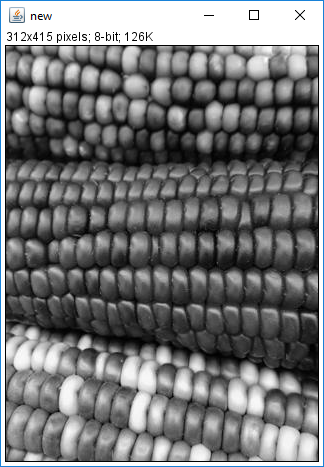

# copytoImagePlus
`copytoImagePlus` is a MATLAB function. Assuming you have communication between ImageJ and MATLAB via [ImageJ-MATLAB](https://imagej.net/MATLAB_Scripting), `copytoImagePlus` allows you to turn a MATLAB array into ImageJ1 `ImagePlus` object (a hyperstack).

+ This function is similar to [`ijmshow`](https://github.com/kouichi-c-nakamura/ijmshow), but unlike `ijmshow`, `copytoImagePlus` does not require `net.imagej.matlab.ImageJMATLABCommands` object `IJM` in base MATLAB Workspace. Therefore, `copytoImagePlus ` can be used both  when you launch an instance of ImageJ from within MATLAB (like `ijmshow`) and when you launch an instance of MATLAB from ImageJ. 

+ [`copytoImg`](https://github.com/fiji/fiji/blob/master/scripts/copytoImg.m) and [`copytoImgPlus` ](https://github.com/fiji/fiji/blob/master/scripts/copytoImgPlus.m) are bundled with Fiji and work in a similar way but using ImageJ2 API and objects, instead of ImageJ1 `ImagePlus` object.

 

## Syntax

```matlab
imp = copytoImagePlus (I)
imp = copytoImagePlus (I,dimorder)
imp = copytoImagePlus (____,'Param',value)
```

Optional Parameter/Value pairs

```text
'NewName'        char row vector | 'new' (default)
	               The window title of the new image in ImageJ

'FrameInterval'  scalar
                 Time frame sampling interval in seconds
```


## MATLAB code examples

### Launching ImageJ form within MATLAB

```matlab
>> addpath '/Applications/Fiji.app/scripts'
>> ImageJ

>> I = imread('peppers.png') % the size of I is 384 x 512 x 3 in MATLAB
>> imp = copytoImagePlus(I)
>> imp.show();
```


```matlab
>> imp = copytoImagePlus(I,'XYC')
>> imp.show();
```


#### 5D hyperstack

Open a sample hyperstack image in ImageJ.

```matlab
>> imp = ij.IJ.openImage("http://imagej.nih.gov/ij/images/Spindly-GFP.zip");
>> imp.show();
>> imp.setZ(3);
```


Retrieve the array of image data to MATLAB. Note that X and Y axes are flipped over.

```matlab
>> IJM.getDatasetAs('I');
>> size(I) 
```

```text
ans =
   171   196     2     5    51
```

Data is in double type, although they are better in uint16 type.

```matlab
>> class(I)
```

```text
ans =
    'double'
```


```matlab
>> I16 = uint16(I); % convert to uint16
>> imp2 = copytoImagePlus(I16,'XYCZT') % flip the X and Y axes back 
>> imp2.show()
```


### Launching MATLAB from ImageJ

Execute a MATLAB script from Fiji's Macro Editor.  ***File > New > Script*** and select ***Language > MATLAB***

```matlab
addpath('scripts')
Miji(false) % add Fiji to Jave class path
I = imread('corn.tif',3);
imp = copytoImagePlus(I) % the function needs to be in MATLAB search path
imp.show();
```




#### `copytoImagePlus_test`

This is a `matlab.unittest.TestCase` subclass and verify the numeric values and dimensions of the `ImagePlus` objects in ImageJ opened by `copytoImagePlus`. 


### Issues

- 12bit data is not well supported or tested
- `FrameInterval` may not be properly set, because File Info... does not show the Frame Interval.
- [`copytoImg`](https://github.com/fiji/fiji/blob/master/scripts/copytoImg.m) and [`copytoImgPlus` ](https://github.com/fiji/fiji/blob/master/scripts/copytoImgPlus.m) are bundled with Fiji and work in a similar way but using ImageJ2 API and objects.


### Contacts

Kouichi C. Nakamura, Ph.D.

[kouichi.c.nakamura@gmail.com](mailto:kouichi.c.nakamura@gmail.com)

MRC Brain Network Dynamics Unit, Department of Pharmacology, University of Oxford